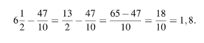
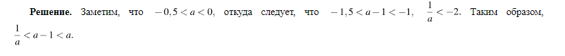
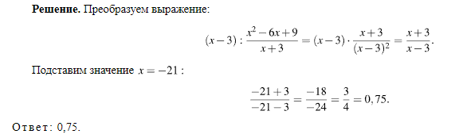

Решение. Пунктирной линей на графике показан трафик мобильного интернета в гигабайтах, израсходованных за каждый месяц года.

Из рисунка видно, что 2,5 Гб было потрачено в первый месяц, 3 Гб  — потрачено в шестой, 3,25 Гб  — в десятый, 1 Гб  — в седьмой.

 Ответ: 16107.

Решение. По рисунку видно, что за июнь абонент потратил 3 Гб интернета, 325 минут исходящих вызовов, и в условии сказано, что за год отправил 110 СМС.

Количество потраченного интернета и СМС не превысило это количество в пакете тарифа, а исходящих вызовов сверх пакета было потрачено  минут.

Вычислим стоимость услуг связи, потраченных абонентом в июне:

 рублей.

 Ответ: 425.

Решение. Пунктирной линей на графике показан трафик мобильного интернета в гигабайтах, израсходованных за каждый месяц года, а сплошной линей  — количество минут исходящих вызовов.

За период январь−февраль расход минут увеличился, и расход гигабайтов увеличился.

За период февраль−март расход минут уменьшился, и расход гигабайтов уменьшился.

За период август–сентябрь расход гигабайтов увеличился, а расход минут уменьшился.

За период ноябрь–декабрь расход минут увеличился, а расход гигабайтов уменьшился.

Таким образом, получается соответствие: А  — 3, Б  — 4, В  — 2, Г  — 1.

 Ответ: 3421.

Решение. Сплошной линей на графике показано количество минут исходящих вызовов, израсходованных за каждый месяц года.

Из рисунка видно, что в третьем месяце было потрачено 150 минут, что является наименьшим количеством за 2019 год.

Ответ: 150.

Решение. Рассмотрим все варианты.

При покупке в салоне А начальный взнос составит 0,2 · 18 000  =  3600 руб., а сумма ежемесячных выплат составит 6 · 2650  =  15 900 руб. Всего 3600 + 15 900  =  19 500 руб.

При покупке в салоне Б начальный взнос составит 0,3 · 17 500  =  5250 руб., а сумма ежемесячных выплат составит 12 · 1200  =  14 400 руб. Всего 5250 + 14 400  =  19 650 руб.

При покупке в салоне В начальный взнос составит 0,25 · 17 600  =  4400 руб., а сумма ежемесячных выплат составит 12 · 1300  =  15 600 руб. Всего 4400 + 15 600  =  20 000 руб.

Самое дешевой является покупка в салоне A.

Ответ: 19 500.

Решение. Вычислим:

Ответ: 1,8.

Решение

решение

